# Real Estate


[](https://github.com/MatheusLeiteCarneiro/real-estate/actions/workflows/ci.yml)
[](LICENSE)

A real estate platform built as a **multi-module Maven monorepo**: a resource API, a dedicated OAuth2/OIDC Authorization Server, and a session-based Backend-for-Frontend (BFF) that sits between the web client and the rest of the system. Each module is independently deployable and horizontally scalable, backed by PostgreSQL, Redis, and Flyway-managed migrations, and orchestrated locally with Docker Compose.

The project started as a way to practice backend development with a more realistic structure than a simple CRUD, and evolved into a small distributed system: token-based service-to-service authentication, cookie-based browser sessions, CSRF/CORS handling for a single-page application, and infrastructure that survives instances being killed or scaled out.

## Project Status

- Backend foundation for a real estate marketplace, built with production-shaped concerns in mind: security, statelessness where it matters, horizontal scalability, and clear module boundaries.
- Runs locally end-to-end with Docker Compose: database, cache, migrations, API, Authorization Server, and BFF.
- The API and Authorization Server are stable and tested. The BFF is functionally complete (OAuth2 login, session management, API proxying, CSRF/CORS) and validated end-to-end with a real browser flow.
- **Next step: building the web frontend** that will consume the BFF (see [Roadmap](#roadmap)).

## Modules

| Module | Port | Responsibility |
|---|---|---|
| [`migrations`](migrations) | — | Flyway migrations for the shared PostgreSQL schema. No application code. |
| [`api`](api) | `8080` | The resource server. Owns property, image, and business rules. Stateless, authenticated via JWT `Bearer` tokens. |
| [`auth-server`](auth-server) | `9000` | The OAuth2 Authorization Server / OpenID Provider. Owns user credentials, issues tokens, handles login and OIDC logout. |
| [`bff`](bff) | `8081` | Backend-for-Frontend. The only module meant to talk to a browser. Confidential OAuth2 client of `auth-server`; proxies authenticated calls to `api`. |

Every module is its own Spring Boot application with its own `Dockerfile`, and can be scaled independently behind a load balancer — sessions and OAuth2 tokens live in Redis, not in process memory, so any instance of the `bff` or `auth-server` can serve any request.

## Architecture

```mermaid
sequenceDiagram
    autonumber
    actor Browser
    participant BFF
    participant Auth as Authorization Server
    participant API
    participant Redis
    participant DB as PostgreSQL

    rect rgb(30, 41, 59)
    note over Browser, Auth: Login — only starts from an explicit user action
    Browser->>BFF: GET /oauth2/authorization/real-estate-bff
    BFF->>Auth: Authorization request + PKCE challenge
    Auth-->>Browser: Login form (AUTHSESSION cookie)
    Browser->>Auth: Submit credentials
    Auth-->>BFF: Redirect with authorization code
    BFF->>Auth: Exchange code + PKCE verifier for tokens
    Auth-->>BFF: access_token + id_token
    BFF->>Redis: Store session + tokens (bff:session)
    BFF-->>Browser: Set-Cookie BFFSESSION, redirect to frontend
    end

    rect rgb(30, 41, 59)
    note over Browser, DB: Authenticated request, proxied through the BFF
    Browser->>BFF: GET/POST /api/... (BFFSESSION cookie + X-XSRF-TOKEN)
    BFF->>Redis: Load session + access_token
    BFF->>API: Authorization: Bearer access_token
    API->>Auth: Validate JWT via JWKS
    API->>DB: Query / persist data
    API-->>BFF: JSON response
    BFF-->>Browser: Forwarded response
    end

    rect rgb(30, 41, 59)
    note over Browser, Auth: Logout — OIDC RP-Initiated, ends both sessions
    Browser->>BFF: POST /logout (X-XSRF-TOKEN)
    BFF->>Redis: Invalidate BFF session
    BFF-->>Browser: Redirect to Authorization Server /connect/logout
    Browser->>Auth: GET /connect/logout (id_token_hint)
    Auth->>Redis: Invalidate AUTHSESSION via SessionRegistry (sid claim)
    Auth-->>Browser: Redirect to frontend
    end
```



**The browser never talks to the API directly, and never holds an access token.** It only ever holds a `BFFSESSION` cookie. The BFF is the sole client-facing entry point; the API is only ever reached server-to-server.

### Why a BFF

- Tokens never reach the browser, so they can't be stolen through XSS reading `localStorage`, and a leaked cookie is a session, not a long-lived credential.
- The frontend only deals with cookies and plain JSON — no OAuth2 client logic, no token refresh, no PKCE, none of it lives in the browser.
- The API stays a pure, stateless resource server, agnostic of *how* a caller authenticated — it only ever sees a validated JWT, whether the caller is the BFF, a mobile client, or a service script.

## Authentication & Session Flow

1. The user clicks "Log in" on the frontend, which navigates the browser to `GET /oauth2/authorization/real-estate-bff` on the **BFF** — login only ever starts from an explicit user action, never automatically.
2. The BFF starts an OAuth2 Authorization Code flow with PKCE against the **Authorization Server**, which authenticates the user (Spring Security form login) and redirects back with an authorization code.
3. The BFF exchanges the code (plus the PKCE verifier) for tokens directly with the Authorization Server, and stores them **server-side**, tied to the browser's session (`BFFSESSION` cookie, session data in Redis under `bff:session`).
4. Every subsequent request from the browser only carries the session cookie. The BFF resolves it to the stored tokens, attaches `Authorization: Bearer <access_token>` to the outgoing call to the **API**, and refreshes the access token automatically when it's close to expiring (`OAuth2AuthorizedClientManager` + `OAuth2ClientHttpRequestInterceptor`).
5. The API validates the JWT against the Authorization Server's JWKS endpoint and enforces role-based authorization (`ROLE_BROKER`, `ROLE_ADMIN`) independently of how the request got there.
6. Logout is OIDC RP-Initiated Logout: the BFF ends its own session and redirects through the Authorization Server's `/connect/logout`, which validates the session via the `sid` claim (backed by `SpringSessionBackedSessionRegistry`) and ends the Authorization Server's own session too — a single logout call ends both.

### CSRF & CORS (BFF)

The BFF authenticates browser requests with an ambient credential (a cookie), so — unlike the API, which is stateless and Bearer-token authenticated — it needs CSRF protection:

- **Double-submit cookie pattern**: a `XSRF-TOKEN` cookie (readable by JavaScript, unlike the session cookie) must be echoed back by the client in an `X-XSRF-TOKEN` header on every state-changing request (`POST`/`PATCH`/`DELETE`).
- **CORS** is scoped to the configured frontend origin only, with `allowCredentials(true)` so the session and CSRF cookies are actually sent cross-origin.

### Proxying & Response Forwarding (BFF → API)

Every BFF controller is a thin proxy: it forwards the request to the corresponding `api` endpoint and relays the response back, through a shared `ApiResponses.forward(...)` helper that:

- Copies status, `Content-Type`, and body byte-for-byte, without leaking upstream transport headers (`Transfer-Encoding`, etc.).
- Rewrites the `Location` header on `201 Created` responses so it points back at the BFF instead of the API's internal host/port.
- Translates upstream error responses (`RestClientResponseException`) into the same status and body the API produced, instead of a generic `500`.
- Routes are matched against the exact authentication requirement the API enforces for that resource — some property/image reads are public, some are public-with-more-detail-if-authenticated, and writes always require a valid session.

## Highlights

- OAuth2 Authorization Server (Spring Authorization Server) with Authorization Code + PKCE, and OIDC RP-Initiated Logout
- BFF pattern: cookie-based browser sessions, tokens held server-side, automatic access token refresh
- CSRF (double-submit cookie) and CORS configured for the web client
- Redis-backed sessions for both the BFF and the Authorization Server — horizontally scalable, no sticky sessions required (load-balancer tested with killed instances)
- Session-backed `SessionRegistry` so OIDC logout can validate the `sid` claim across instances
- JWT access tokens carrying custom `authorities` and `username` claims; the ID token now carries `authorities` too, so the frontend can render role-restricted UI from a single session check
- Role hierarchy where `ADMIN` includes `BROKER` permissions (enforced only in the API, never leaked upstream)
- Broker ownership validation for property and image mutations; admin-only user management
- Public property catalog with filtering, sorting, pagination, and primary images
- Cloudinary integration for property image uploads and deletion, proxied through the BFF as real multipart requests
- Transactional rollback behavior for failed image uploads
- Flyway-managed PostgreSQL schema evolution, shared by API and Authorization Server
- Docker Compose orchestration for the full stack, with health checks and Redis persistence (AOF)
- Swagger UI and Postman collection configured for OAuth2 PKCE testing against the API directly

## Tech Stack

| Area | Technology |
|---|---|
| Language | Java 25 |
| Framework | Spring Boot 4.0.6 |
| API | Spring Web MVC, Bean Validation, SpringDoc OpenAPI |
| Security | Spring Security 7.0.5, Spring Authorization Server, OAuth2 Resource Server, OAuth2 Client, JWT, PKCE |
| BFF client | Spring `RestClient` (blocking, no reactive stack needed) |
| Sessions | Spring Session Data Redis (indexed repository on the Authorization Server, for `sid` lookups) |
| Database | PostgreSQL, Spring Data JPA, Hibernate |
| Cache / Sessions store | Redis 7 |
| Migrations | Flyway |
| File storage | Cloudinary |
| Tooling | Maven (multi-module), Maven Wrapper, Docker, Docker Compose |
| Testing | JUnit, Spring Boot Test, Spring Security Test, Testcontainers |

## Domain Overview

The platform models a real estate marketplace where public visitors can browse available properties, brokers manage their own listings, and admins manage users and see the full inventory.

Core domain concepts:

- `Property`: title, description, price, transaction type, category, area, room details, availability, address, broker owner, and images.
- `Image`: uploaded media linked to a property, including one primary image.
- `User`: authenticated account with `ROLE_ADMIN` or `ROLE_BROKER`, owned by the Authorization Server.
- `Address`: structured address data with state and ZIP code normalization.

Supported property categories:

```text
APARTMENT, HOUSE, COMMERCIAL, LAND, STUDIO, FARM
```

Supported transaction types:

```text
SALE, RENT
```

## Docker Compose

```bash
docker compose up -d --build
```

This single command brings up the entire stack:

| Service | Image / build | Purpose |
|---|---|---|
| `database` | `postgres:15-alpine` | Shared PostgreSQL instance, with a health check gating everything downstream. |
| `redis` | `redis:7-alpine` | Session and OAuth2 client storage, password-protected, AOF persistence enabled. |
| `migrations` | `flyway/flyway` | Runs once, applies the schema, exits. Everything else waits on it. |
| `api` | `api/Dockerfile` | The resource server, `:8080`. |
| `auth-server` | `auth-server/Dockerfile` | The Authorization Server, `:9000`. |
| `bff` | `bff/Dockerfile` | The BFF, `:8081`. |

Each service has its own `depends_on` chain (health checks and `service_completed_successfully` for migrations) so the stack always comes up in the right order. Because sessions and tokens live in Redis rather than in-process, any of `api`, `auth-server`, or `bff` can be scaled to multiple replicas behind a load balancer without sticky sessions — this has been tested directly (killing individual replicas mid-session and confirming the flow survives).

## Getting Started

### Prerequisites

- Java 25
- Docker and Docker Compose
- Maven is optional — the project includes `mvnw`
- A Cloudinary account for real image uploads
- OpenSSL for generating local RSA keys (used by the Authorization Server to sign JWTs)

### 1. Clone the repository

```bash
git clone https://github.com/MatheusLeiteCarneiro/real-estate.git
cd real-estate
```

### 2. Create the environment files

Each module has its own `.env.example`, plus a shared one at the repository root:

```bash
cp .env.example .env
cp api/.env.example api/.env
cp auth-server/.env.example auth-server/.env
cp bff/.env.example bff/.env
```

Update the values according to your local environment. Each module only reads its own `.env` — the root one is used solely by Docker Compose itself, not by any Spring Boot module — so values shared between modules (database and Redis credentials, the OAuth2 issuer URL, the Swagger client ID) need to be set consistently in each `.env` that needs them. See [How `.env` loading works](#how-env-loading-works) for the full explanation.

### 3. Generate local JWT signing keys

The Authorization Server signs tokens with an RSA key pair:

```bash
mkdir -p auth-server/secrets
openssl genrsa -out auth-server/secrets/app.key 2048
openssl rsa -in auth-server/secrets/app.key -pubout -out auth-server/secrets/app.pub
```

### 4. Run everything with Docker Compose

```bash
docker compose up -d --build
```

| Module | URL |
|---|---|
| API | http://localhost:8080 |
| Authorization Server | http://localhost:9000 |
| BFF | http://localhost:8081 |

## API Overview

The BFF exposes browser-facing routes under `/api/**` on `:8081`, mirroring the API's own `/v1/**` routes on `:8080` one level up (same resource, different authentication mechanism). The API's routes below are for server-to-server calls, Swagger, and Postman — a browser client should always go through the BFF instead.

### Public Endpoints (API)

| Method | Endpoint | Description |
|---|---|---|
| `GET` | `/actuator/health` | Application health |
| `GET` | `/v3/api-docs` | OpenAPI JSON |
| `GET` | `/v1/properties` | List available properties |
| `GET` | `/v1/properties/{propertyId}` | Get property details |
| `GET` | `/v1/properties/{propertyId}/images` | List property images |
| `GET` | `/v1/properties/{propertyId}/images/primary` | Get the primary property image |

### Auth and Discovery (Authorization Server)

| Method | Endpoint | Description |
|---|---|---|
| `GET` | `/.well-known/openid-configuration` | OpenID Connect discovery metadata |
| `GET` | `/oauth2/jwks` | JSON Web Key Set |
| `POST` | `/oauth2/token` | Token exchange and refresh token flow |
| `GET` | `/oauth2/authorize` | Authorization endpoint (Authorization Code + PKCE) |
| `POST` | `/connect/logout` | OIDC RP-Initiated Logout |

### Broker/Admin Endpoints (API)

| Method | Endpoint | Description |
|---|---|---|
| `POST` | `/v1/properties` | Create a property |
| `PATCH` | `/v1/properties/{propertyId}` | Partially update a property |
| `PATCH` | `/v1/properties/{propertyId}/toggle-active` | Toggle property availability |
| `DELETE` | `/v1/properties/{propertyId}` | Delete a property |
| `GET` | `/v1/properties/all` | List all properties, including unavailable ones |
| `POST` | `/v1/properties/{propertyId}/images` | Upload property images |
| `PATCH` | `/v1/properties/{propertyId}/images/{imageId}/primary` | Set the primary property image |
| `DELETE` | `/v1/properties/{propertyId}/images/{imageId}` | Delete an image |

### Authenticated User (API)

| Method | Endpoint | Description |
|---|---|---|
| `GET` | `/v1/users/me` | Return the current authenticated user |

### Admin Endpoints (API)

| Method | Endpoint | Description |
|---|---|---|
| `GET` | `/v1/users` | List users with filters |
| `GET` | `/v1/users/{userId}` | Get user details |
| `POST` | `/v1/users` | Create a broker user |
| `PATCH` | `/v1/users/{userId}` | Partially update a user |
| `PATCH` | `/v1/users/{userId}/toggle-active` | Toggle user active status |
| `GET` | `/v1/users/{brokerId}/properties` | List properties owned by a broker |

### BFF Session Endpoint

| Method | Endpoint | Description |
|---|---|---|
| `GET` | `/api/bff/session` | Public. Returns `{ authenticated, username, authorities }` for the current cookie session. The frontend should call this proactively to decide what to render, instead of reacting to a failed request. |

## Filtering and Pagination

Property listing endpoints support pageable Spring parameters:

```text
page=0
size=20
sort=createdAt,desc
```

Available property filters:

```text
search
minPrice
maxPrice
minArea
maxArea
transactionType
category
minBedrooms
maxBedrooms
minBathrooms
minSuites
minParkingSpots
```

User listing supports:

```text
username
role
isActive
```

Example:

```http
GET /v1/properties?search=pool&transactionType=SALE&category=HOUSE&page=0&size=10&sort=price,asc
```

## Swagger UI

Swagger UI is available at:

```text
http://localhost:8080/swagger-ui/index.html
```

The OpenAPI configuration includes an OAuth2 Authorization Code flow with PKCE against the Authorization Server.

### CORS for the browser-side token exchange

`swagger-client` is a **public** client (PKCE instead of a secret), so the code-for-token exchange happens directly in the browser, as a cross-origin call from the Swagger UI page (`:8080`) to the Authorization Server (`:9000`). That requires CORS on `/oauth2/token`, enabled only in the `dev` profile (`SWAGGER_UI_ORIGIN` in `auth-server/.env`) and fully closed in `prod`.

### Authenticated Endpoint Example


For local development, use:

```text
Client ID: swagger-client
Scopes: openid
```

## Postman

This repository includes:

```text
real-estate.postman_collection.json
real-estate.api.postman_environment.json
```

Recommended flow:

1. Import both files into Postman.
2. Select the `Real Estate - API` environment.
3. Update the credentials in the `Real Estate - API` environment.
4. Open the collection Authorization tab.
5. Confirm the grant type is `Authorization Code (With PKCE)`.
6. Click `Get New Access Token`.
7. Log in with a broker or admin user.
8. Click `Use Token`.

Protected requests inherit OAuth2 auth from the collection, so the `Authorization` header is generated by Postman. This exercises the API directly (the same way the BFF does server-to-server), not the BFF's cookie-based flow.

## Environment Variables

### How `.env` loading works

Each module (`api`, `auth-server`, `bff`) depends on [`dotenv-java`](https://github.com/cdimascio/dotenv-java) and only reads its **own** `.env`. The root `.env` exists purely because `docker-compose.yml` reads it directly (via `${VAR}` substitution) to configure the `database` and `redis` services, which aren't owned by any single module; no Spring Boot code touches that file.

This means a handful of values — database and Redis credentials, the OAuth2 issuer URL, the Swagger client ID — are intentionally duplicated across the root `.env` and whichever modules need them, each documented with a comment saying which other file it must match. There's no automatic syncing: if you change one, change the others too. The trade-off is deliberate — each module stays fully self-sufficient (its own `.env.example` lists everything it needs, with nothing to cross-reference), which matters if you ever deploy modules independently, each with its own set of environment variables set directly on the platform.

### Root `.env` (docker-compose.yml only)

| Variable | Purpose |
|---|---|
| `SPRING_PROFILES_ACTIVE` | Spring profile (`dev` locally, `prod` for a secure-cookie deployment) |
| `POSTGRES_DB` / `POSTGRES_USER` / `POSTGRES_PASSWORD` | Database credentials, used by the `database` service |
| `REDIS_PASSWORD` | Used by the `redis` service |

### `api/.env`

| Variable | Purpose |
|---|---|
| `SPRING_PROFILES_ACTIVE` | Must match the root `.env` |
| `POSTGRES_DB` / `POSTGRES_USER` / `POSTGRES_PASSWORD` / `DB_HOST` / `DB_PORT` | Must match the root `.env` |
| `AUTHORIZATION_SERVER_URL` | Public issuer URL — must match `auth-server/.env` |
| `JWK_SET_URI` | Where the JWT resource server fetches signing keys from |
| `SWAGGER_CLIENT_ID` | Must match `auth-server/.env` |
| `ADMIN_USERNAME` / `ADMIN_PASSWORD` | Bootstraps an initial admin user on startup, if one with that username doesn't exist yet |
| `CLOUDINARY_URL` | Cloudinary connection URL |
| `PROPERTY_IMAGE_FOLDER` | Cloudinary folder for property images |
| `MAX_FILE_SIZE` / `MAX_REQUEST_SIZE` | Upload size limits (default 10MB / 100MB) |

### `auth-server/.env`

| Variable | Purpose |
|---|---|
| `SPRING_PROFILES_ACTIVE` | Must match the root `.env` |
| `POSTGRES_DB` / `POSTGRES_USER` / `POSTGRES_PASSWORD` / `DB_HOST` / `DB_PORT` | Must match the root `.env` |
| `REDIS_HOST` / `REDIS_PORT` / `REDIS_PASSWORD` | Must match `bff/.env` (both connect to the same Redis instance) |
| `AUTHORIZATION_SERVER_URL` | Public issuer URL — must match `api/.env` |
| `SWAGGER_CLIENT_ID` | Must match `api/.env` |
| `BFF_CLIENT_ID` / `BFF_CLIENT_SECRET` | Confidential OAuth2 client credentials used by the BFF |
| `BFF_REDIRECT_URI` / `BFF_POST_LOGOUT_REDIRECT_URI` | BFF's OAuth2 redirect and post-logout redirect URIs |
| `JWT_PUBLIC_KEY` / `JWT_PRIVATE_KEY` | RSA key pair used to sign JWTs |
| `JWT_ACCESS_TOKEN_DURATION` / `JWT_REFRESH_TOKEN_DURATION` | Token lifetimes, in seconds |
| `SWAGGER_REDIRECT_URI` | Redirect URI for the development Swagger OAuth2 client |
| `SWAGGER_UI_ORIGIN` | Origin allowed via CORS on `/oauth2/token` (dev only), so Swagger UI's browser-side PKCE exchange can complete |
| `POSTMAN_CLIENT_ID` / `POSTMAN_CLIENT_SECRET` / `POSTMAN_REDIRECT_URI` | Development-only client for Postman (dev profile only) |

### `bff/.env`

| Variable | Purpose |
|---|---|
| `SPRING_PROFILES_ACTIVE` | Must match the root `.env` |
| `REDIS_HOST` / `REDIS_PORT` / `REDIS_PASSWORD` | Must match `auth-server/.env` |
| `BFF_CLIENT_ID` / `BFF_CLIENT_SECRET` | Must match the values registered in `auth-server/.env` |
| `BFF_REDIRECT_URI` | Where the Authorization Server redirects after login |
| `AUTH_URI` / `LOGOUT_URI` | Authorization Server endpoints the **browser** is redirected to — must be its public address |
| `TOKEN_URI` / `JWK_SET_URI` | Authorization Server endpoints the **BFF** calls server-to-server — the Docker service name in Compose |
| `FRONTEND_URL` | The frontend's origin — used for CORS, post-login redirect, and post-logout redirect |
| `API_URL` | Base URL the BFF uses to call the API server-to-server |
| `SESSION_TIMEOUT` | Sliding idle session timeout |
| `SESSION_COOKIE_MAX_AGE` | Absolute cookie lifetime (does not slide, should be ≥ `SESSION_TIMEOUT`) |

Uploads are limited to 10MB per file and 100MB per multipart request. Keep `MAX_FILE_SIZE` compatible with your Cloudinary account limits.

## Database Migrations

Flyway manages the schema, shared by the API and the Authorization Server, under:

```text
migrations/src/main/resources/db/migration
```

The migrations cover the property/address schema, image metadata and primary image support, the user and role tables, broker-property ownership, property enum/status refactors, and the OAuth2 authorization persistence schema used by the Authorization Server.

## Testing

Run the complete verification lifecycle for every module with:

```bash
./mvnw clean verify
```

Test coverage includes:

- Application context loading for each module
- Property mapping and service behavior
- Broker ownership validation
- Strong password validation
- PostgreSQL integration tests using Testcontainers
- Flyway migration validation against a real PostgreSQL 15 container
- Property visibility and authorization integration tests
- Image upload rollback behavior

The BFF's OAuth2/session/CSRF/CORS behavior has been validated through manual end-to-end testing (real browser login, multi-instance load-balanced deployments, and full proxy coverage for every write endpoint) rather than automated integration tests so far.

## Example Request

Create a property as an authenticated broker or admin, directly against the API:

```http
POST /v1/properties
Authorization: Bearer <access_token>
Content-Type: application/json
```

```json
{
  "title": "Modern family house",
  "description": "Spacious property near schools, parks, and local shops.",
  "price": 750000.00,
  "transactionType": "SALE",
  "category": "HOUSE",
  "suites": 1,
  "bedrooms": 3,
  "bathrooms": 2,
  "area": 120.50,
  "parkingSpots": 2,
  "address": {
    "street": "Main Street",
    "number": "100",
    "complement": "Apartment 12",
    "neighborhood": "Downtown",
    "city": "Sample City",
    "state": "CA",
    "zipCode": "90000000"
  }
}
```

Through the BFF, the same request is made by a logged-in browser session instead, with the CSRF header and no `Authorization` header at all:

```http
POST http://localhost:8081/api/properties
Cookie: BFFSESSION=...
X-XSRF-TOKEN: <value read from the XSRF-TOKEN cookie>
Content-Type: application/json
```

## Portfolio Notes

This project covers:

- A distributed system split across three independently deployable, independently scalable Spring Boot applications
- The BFF pattern implemented from scratch: OAuth2 confidential client, server-side token storage, automatic refresh, and API proxying
- Cookie-based session security for a browser client: CSRF (double-submit cookie) and CORS, correctly scoped to a stateful client while the API itself stays stateless
- OpenID Connect RP-Initiated Logout with cross-instance session validation via the `sid` claim
- Redis as shared, horizontally-scalable session storage — validated with a real load-balanced, sticky-session-free deployment
- Practical ownership and role-based authorization rules for a multi-user business domain
- Real database migration management instead of generated schemas
- Dockerized local development for the full stack, with health checks and correct service-to-service networking

## Roadmap

- **Build the web frontend** consuming the BFF's session-based API (`/api/bff/session`, `/api/properties`, `/api/users`, ...) — the immediate next step.
- Add deployment manifests for a cloud provider
- Add API rate limiting
- Add audit logging for admin actions